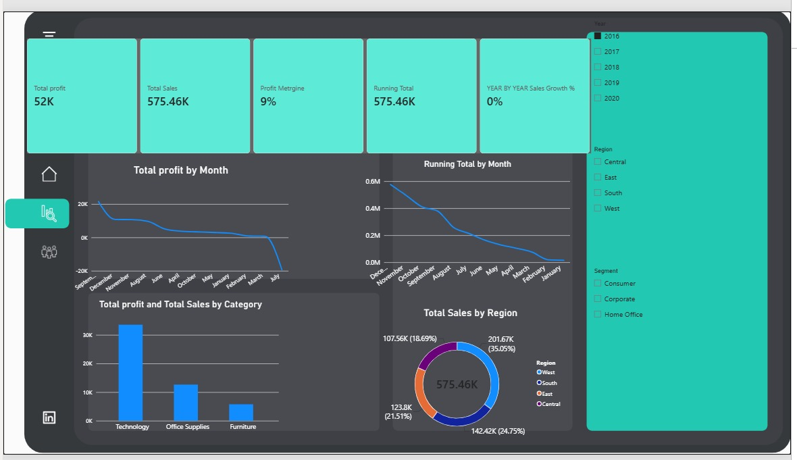
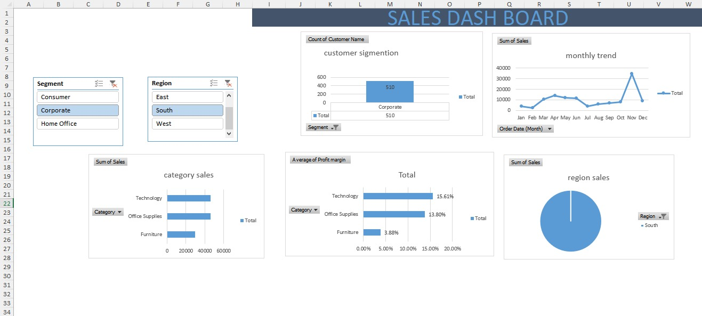

<div align="center">

  

  # Mohammed Eid Gaber Abbas
  ### 📊 Data Analyst · 💼 Financial Reporting · 📈 Business Intelligence
  
  <p align="center">
    <em>Beni-Suef University — Faculty of Commerce (Expected 2027)</em><br />
    <em>Digital Egypt Youth (DEY) Initiative & Digital Egypt Pioneers Initiative (DEPI)</em>
  </p>

  <!-- High-Impact Verified Shields Badges -->
  <p align="center">
    <a href="https://drive.google.com/file/d/1a8JVTQZLFA8iTVltx2l8kLxyhDLTZZom/view?usp=sharing" target="_blank">
      
    </a>
    <a href="Mohammed_Eid_Gaber_Abbas_CV.pdf" target="_blank">
      
    </a>
    <a href="https://www.linkedin.com/in/mohammed-eid-95081b388/" target="_blank">
      
    </a>
    <a href="mailto:mohammedeid5095@gmail.com">
      
    </a>
    
  </p>

</div>

---

## 📌 Executive Summary

> *"Turning business and financial data into clear insights, interactive dashboards, and decision-ready reports."*

Financial Accounting student at **Beni-Suef University's Faculty of Commerce** (Expected Graduation: **2027**), combining **Data Analytics, Business Intelligence, and Accounting & Financial Reporting**. 

Proficient in **Microsoft Excel, SQL, Python, Power BI, and Tableau** to transform raw transactional ledgers and business datasets into clean models, interactive dashboards, and actionable insights. Experienced in KPI tracking and visual storytelling that directly support executive decision-making.

**Target Career Opportunities:** Junior Data Analyst · Financial Data Analyst · Business Intelligence Analyst.

---

## 🛠️ Technical & Financial Competencies

<div align="center">

| Domain | Tools & Technologies | Applied Industry Competencies |
| :--- | :--- | :--- |
| **Data Analytics** | `Excel` · `SQL` · `Python` · `Pandas` | Tabular Data Cleaning, Relational Joins, Aggregations, Exploratory Data Analysis (EDA) |
| **Business Intelligence** | `Power BI Desktop` · `Tableau` · `DAX` | Kimball Star Schema Modeling, Measure Development, Interactive Cross-Filtering, KPI Gauges |
| **Accounting & Finance** | `Financial Accounting` · `Reporting` | Income Statements, Balance Sheets, Financial Ledger Consistency, Margin & Variance Analysis |

</div>

---

## 🚀 Featured Portfolio Projects

### 1. 📈 Sales Store Analytics Dashboard — Power BI Desktop
> **Core Stack:** Power BI Desktop · Kimball Star Schema · DAX Measures · Interactive Cross-Filtering

An enterprise-grade retail business intelligence report engineered to monitor corporate sales performance, profit margins, temporal trends, and regional distributions.

#### 🖥️ Dashboard Overview
<p align="center">
  
</p>

#### 🧩 Relational Data Model (Kimball Star Schema)
<p align="center">
  
</p>

#### 🎯 Executive Target Gauge Visual
<p align="center">
  
</p>

#### 🔍 Technical & Analytical Highlights:
- **Dimensional Modeling:** Constructed a pure **Kimball Star Schema** centering on the transactional fact table (`FOrders`) with 1-to-many relationships connected to three dimension tables:
  - `Dcustomer`: Customer segmentation and geographic profiles.
  - `Dproduct`: Category and sub-category hierarchies.
  - `Dcalendar`: Time intelligence and date dimension table.
- **Dedicated DAX Measures Table (`keymeasure`):**
  ```dax
  // Core Sales & Profitability KPIs
  Total Sales = SUM(FOrders[Sales])
  Total Profit = SUM(FOrders[Profit])
  Profit Margin % = DIVIDE([Total Profit], [Total Sales], 0)
  
  // Time Intelligence & Benchmarks
  Sales YTD = TOTALYTD([Total Sales], Dcalendar[Date])
  YoY Sales Growth = DIVIDE([Total Sales] - [Sales LY], [Sales LY], 0)
  ```
- **Observed Business Insights:**
  - **West Region** generated the highest sales contribution (**35.05%**), followed by Central (**24.75%**), East (**21.51%**), and South (**18.69%**).
  - **Technology Category** yielded the highest profit margin, while **Furniture** operated under tighter margins, providing management with clear guidance for inventory allocation.

---

### 2. 📑 Excel Data Analysis & Reporting Dashboard — Microsoft Excel
> **Core Stack:** Microsoft Excel · Dynamic PivotTables · Interactive Slicers · PivotCharts · Financial Formulas

A structured operational reporting dashboard designed to clean, aggregate, and model transactional sales records, providing stakeholders with clear margin visibility and seasonal trend analysis.

#### 📊 Excel Sales Dashboard
<p align="center">
  
</p>

#### 🔍 Technical & Analytical Highlights:
- **Interactive Pivot Slicers:** Connected multi-table slicers allowing real-time slice-and-dice by **Customer Segment** (`Consumer`, `Corporate`, `Home Office`) and **Region** (`East`, `South`, `West`).
- **Segment Breakdown:** Quantifies client volume distribution across enterprise tiers (e.g., Corporate client base count: **510**).
- **Monthly Demand Velocity:** Identified temporal demand surges with significant order volume peaking during **November**.
- **Category Profit Margin Benchmarks:**
  | Product Category | Profit Margin % | Business Impact |
  | :--- | :---: | :--- |
  | **Technology** | **15.61%** | Highest margin generator |
  | **Office Supplies** | **13.80%** | Stable recurring volume |
  | **Furniture** | **3.88%** | Requires operational cost control |

---

## 🎓 Education & Professional Development

### 🏛️ Beni-Suef University — Faculty of Commerce
- **Degree:** Bachelor of Commerce, Financial Accounting
- **Location:** Beni Suef, Egypt
- **Expected Graduation:** **2027**
- **Academic Foundation:** Financial Accounting, Ledger Structures, Financial Statement Preparation, Commercial Law, Economics.

### 🌟 Professional Development Programs
- **Digital Egypt Youth (DEY) Initiative & Digital Egypt Pioneers Initiative (DEPI):**
  - High-impact national initiative enhancing technical and career capabilities in **Data Analytics** and **Business Intelligence**.
  - Practical execution in relational database querying (SQL), Python analytical scripting, and enterprise dashboard reporting (Power BI & Tableau).

---

## 📂 Repository Architecture

```text
├── index.html                           # Complete responsive personal portfolio website
├── README.md                            # Comprehensive GitHub documentation & portfolio overview
├── Mohammed_Eid_Gaber_Abbas_CV.pdf      # Official verified PDF Curriculum Vitae
├── WhatsApp Image 2026-10-05 at 9.42.14 PM.jpeg  # Candidate official portrait photo
├── css/
│   └── style.css                        # Modern design system, themes, glassmorphism, animations
├── js/
│   └── main.js                          # Navigation, interactive widgets, modals, lightbox
└── img/                                 # Authentic project screenshots & architecture diagrams
    ├── Dashboard.jpeg                   # Power BI Dashboard View
    ├── RelationalDataModel.jpeg         # Power BI Star Schema Model
    ├── ExecutiveTargetGaugeVisual.jpeg  # Power BI KPI Target Gauge
    └── ExcelSalesDashboard.jpeg         # Microsoft Excel Sales Dashboard
```

---

## 📬 Contact & Connect

<div align="center">

| Channel | Details | Quick Action |
| :--- | :--- | :--- |
| **Google Drive CV** | Official Verified Cloud Document | [**View CV on Google Drive**](https://drive.google.com/file/d/1a8JVTQZLFA8iTVltx2l8kLxyhDLTZZom/view?usp=sharing) |
| **Local PDF CV** | Direct Download | [**Download PDF**](Mohammed_Eid_Gaber_Abbas_CV.pdf) |
| **LinkedIn** | Professional Profile | [**linkedin.com/in/mohammed-eid-95081b388**](https://www.linkedin.com/in/mohammed-eid-95081b388/) |
| **Email** | Direct Business Inquiries | [**mohammedeid5095@gmail.com**](mailto:mohammedeid5095@gmail.com) |
| **Phone / WhatsApp** | Mobile & WhatsApp | `+20 120 229 4465` / `01202294465` |
| **Live Portfolio** | Open `index.html` in any web browser | [**Launch Portfolio Website**](index.html) |

<br />

*© 2026 Mohammed Eid Gaber Abbas. All rights reserved.*

</div>
